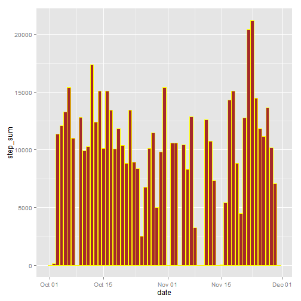
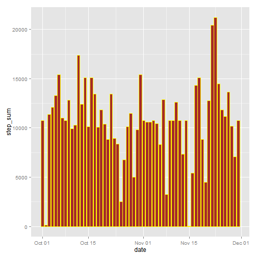
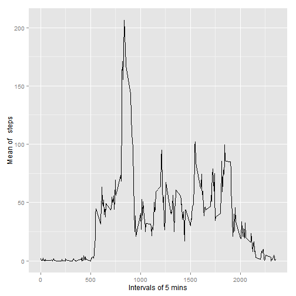
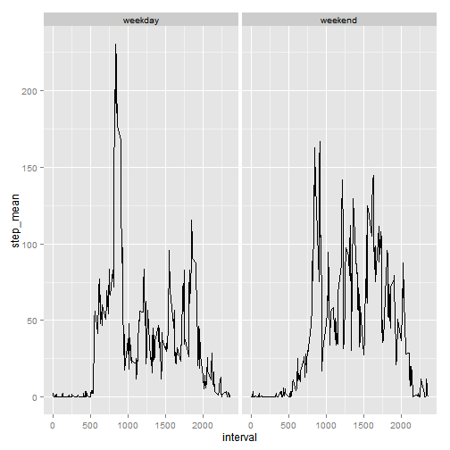

##Libraries Used:

```r
  library(dplyr)
  library(tidyr)
  library(data.table)
  library(ggplot2)
```
#*Loading and preprocessing the data:*

```r
  data<-read.csv("activity.csv")   #Reading the csv data
  data<- data.table(data)          #Converting to table format
  data$date<- as.Date(data$date)   #Converting the date class from factor to date
  data<- mutate(data,month= as.POSIXlt(data$date)$mon+1)
                                   #Adding month column to the table  
```

##*What is mean total number of steps taken per day?*

-For this part of the assignment, you can ignore the missing values in the dataset      .

-Calculate the total number of steps taken per day.

-If you do not understand the difference between a histogram and a barplot, research the difference between them. Make a histogram of the total number of steps taken each day.

-Calculate and report the mean and median of the total number of steps taken per day.


```r
  data1<- group_by(data,date) #saving the grouped data in variable data1
  step2<- summarize(data1,step_sum=sum(steps,na.rm=T))   #summarizing the data1 to      #calculate the total number of steps taken everyday.
  ggplot(step2,aes(x=date))+geom_histogram(aes(y=step_sum),stat="identity",fill="brown",binwidth=1,colour="yellow")
```

 

```r
  mean(step2$step_sum,na.rm=T)
```

```
## [1] 9354.23
```

```r
  median(step2$step_sum,na.rm=T)
```

```
## [1] 10395
```


##*What is the average daily activity pattern?*

-Make a time series plot (i.e. type = "l") of the 5-minute interval (x-axis) and the average number of steps taken, averaged across all days (y-axis)

-Which 5-minute interval, on average across all the days in the dataset, contains the maximum number of steps?


```r
  by_interval<- group_by(data,interval)
  step3<- summarize(by_interval,step_mean=mean(steps,na.rm=T))
  qplot(step3$interval,step3$step_mean,xlab="Intervals of 5 mins",ylab="Mean of   steps",geom="line")
```

 

```r
  print("The interval in which maximum no. of steps were taken= ")
```

```
## [1] "The interval in which maximum no. of steps were taken= "
```

```r
  step3$interval[step3$step_mean==max(step3$step_mean)]
```

```
## [1] 835
```


##*Imputing missing values*

-Note that there are a number of days/intervals where there are missing values (coded as NA). The presence of missing days may introduce bias into some calculations or summaries of the data.

-Calculate and report the total number of missing values in the dataset (i.e. the total number of rows with NAs)

-Devise a strategy for filling in all of the missing values in the dataset. The strategy does not need to be sophisticated. For example, you could use the mean/median for that day, or the mean for that 5-minute interval, etc.

-Create a new dataset that is equal to the original dataset but with the missing data filled in.

-Make a histogram of the total number of steps taken each day and Calculate and report the mean and median total number of steps taken per day. Do these values differ from the estimates from the first part of the assignment? What is the impact of imputing missing data on the estimates of the total daily number of steps?


```r
  new_data<- data
  bad<-is.na(data$steps)
  c<-0
  j<-1
  for (i in 1:17568)
  {
  if (bad[i]=="TRUE")
    {
  new_data$steps[i]<- step3$step_mean[j]
  c<- c+1
  j<-j+1
    }
  if(j>288)
    j<-1
  }
  print("The total number of missing values in the dataset=")
```

```
## [1] "The total number of missing values in the dataset="
```

```r
  print(c)
```

```
## [1] 2304
```

```r
  new_data1<- group_by(new_data,date) #saving the grouped data in new variable new_data1
  step4<- summarize(new_data1,step_sum=sum(steps))   #summarizing the new_data1 to calculate the total number of steps taken everyday.
  ggplot(step4,aes(x=date))+geom_histogram(aes(y=step_sum),stat="identity",fill="brown",binwidth=1,colour="yellow") #Plotting the histogram with the updated data
```

 

```r
  print("Mean= "); mean(step4$step_sum,na.rm=T)
```

```
## [1] "Mean= "
```

```
## [1] 10766.19
```

```r
  print("Median ="); median(step4$step_sum,na.rm=T)
```

```
## [1] "Median ="
```

```
## [1] 10766.19
```

```r
  by_interval4<- group_by(new_data,interval) #Grouping the data with the interval parameter
  step4a<- summarize(by_interval4,step_mean=mean(steps,na.rm=T)) # Summarizing the data to find the mean of steps versus 5 minute interval
  qplot(step4a$interval,step4a$step_mean,xlab="Intervals of 5 mins",ylab="Mean of   steps",geom="line") #Plotting the data b/w the mean of steps and 5 minute interval
```

 

```r
  print("The interval in which maximum no. of steps were taken= ")
```

```
## [1] "The interval in which maximum no. of steps were taken= "
```

```r
  step4a$interval[step4a$step_mean==max(step4a$step_mean)]
```

```
## [1] 835
```

```r
  print ("There has been changes in the value of the mean and median of the two data sets when the NA's where replaced by the mean of each day")
```

```
## [1] "There has been changes in the value of the mean and median of the two data sets when the NA's where replaced by the mean of each day"
```

##*Are there differences in activity patterns between weekdays and weekends?*

-For this part the weekdays() function may be of some help here. Use the dataset with the filled-in missing values for this part.

-Create a new factor variable in the dataset with two levels - "weekday" and "weekend" indicating whether a given date is a weekday or weekend day.

-Make a panel plot containing a time series plot (i.e. type = "l") of the 5-minute interval (x-axis) and the average number of steps taken, averaged across all weekday days or weekend days (y-axis). See the README file in the GitHub repository to see an example of what this plot should look like using simulated data.


```r
  week_day<- weekdays(new_data1$date) # converting the date to week day
df<- "weekday"
  for(i in 1:length(week_day))
    {
if(week_day[i]=="Sunday" | week_day[i]=="Saturday")
  df[i]<- "weekend"
else
  df[i]<- "weekday"
    }
df<- as.factor(df)   # new factor variable having the days as weekdays or weekends
final_data<-cbind(df,new_data1)
final_data<-group_by(final_data,df,interval)
step_final<- summarize(final_data,step_mean=mean(steps,na.rm=T))

g<- ggplot(step_final,aes(interval,step_mean))
g+geom_line()+ facet_grid(.~df)
```

 

```r
print("YES there is an activity difference b/w the weekdays and weekends as seen in the plots, the person does less activity on a given weekend, NOT A SURPRISE AT ALL!!!!")
```

```
## [1] "YES there is an activity difference b/w the weekdays and weekends as seen in the plots, the person does less activity on a given weekend, NOT A SURPRISE AT ALL!!!!"
```


